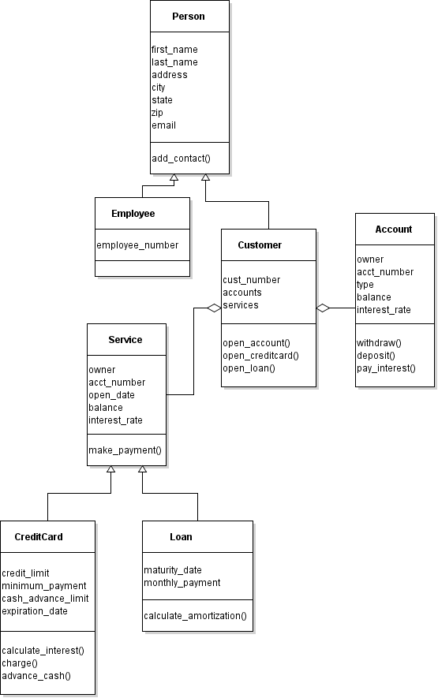

# Simplified banking system
Project for Springboard Data Engineering track subunit 4.6

## Requirements
The simplified banking system was developed on Python version 3.8.5. Earlier Python3 versions may work as well.

The following Python packages are required. Version numbers are recommended:

* SQLAlchemy 1.3.19 (including its SQLite dependencies -- see Troubleshooting section below)
* Logging 0.5.1.2

## Installation and usage

To install, download all scripts to the same folder.

The customer and employee interfaces exist in separate scripts. Each script is interactive, so there is no need to include command line arguments. To start the customer interface, open a command prompt and run:

    python interface_customer.py

Similarly, to start the employee interface, open a command prompt and run:

    python interface_employee.py

## Features

The customer interface allows a customer to review their existing accounts and services, open a new account/service, deposit/withdraw from an account, charge to a card, or make a payment on a service. The employee interface allows an employee to review all customers and their accounts, or apply interest to all relevant accounts/services as part of month-end processing.

## Troubleshooting

### `ImportError: DLL load failed while importing _sqlite3: The specified module could not be found.`
This can happen on Windows in an Anaconda environment. To resolve this, download the relevant SQLite DLL for your system [from this page](https://www.sqlite.org/download.html) and copy to your Anaconda DLLs folder ([see here](https://stackoverflow.com/questions/54876404/unable-to-import-sqlite3-using-anaconda-python) for more specific details).

## Class diagram

